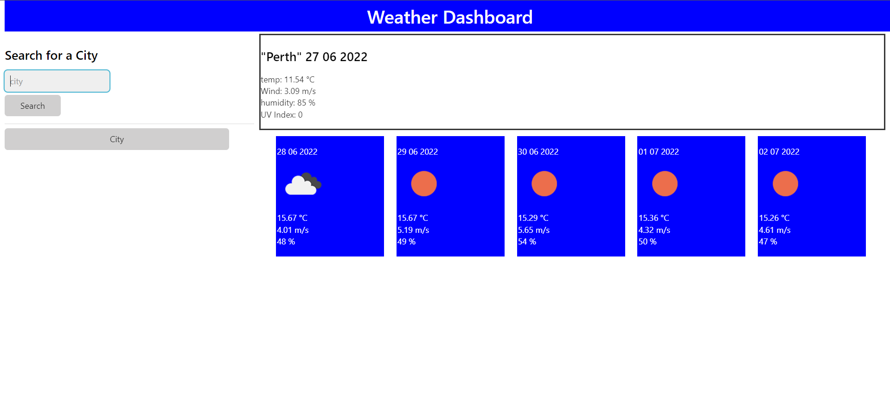

# weatherApp

### This website has been built with the purpose of allowing a user to see the current weather of a desired location, and the forecasted weather of the same location for the next 5 days.
### This website is in its working phase and added functionality is required. This project will soon allow a user to select previously viewed cities and will also have a color coded uv index for current weather
### To use this website, simply type in the name of a desired location and click search to see the current weather and forecasted weather for the next 5 days of the chosen location.
### Future functionality will allow a user to click on a previously viewed location to view weather forecast rather than typing each time
### Please find URL here: https://ethangodley.github.io/weatherApp/
### The website should look like the mockup included below

